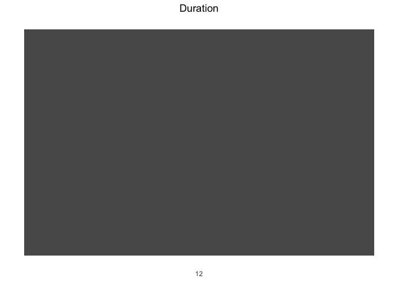
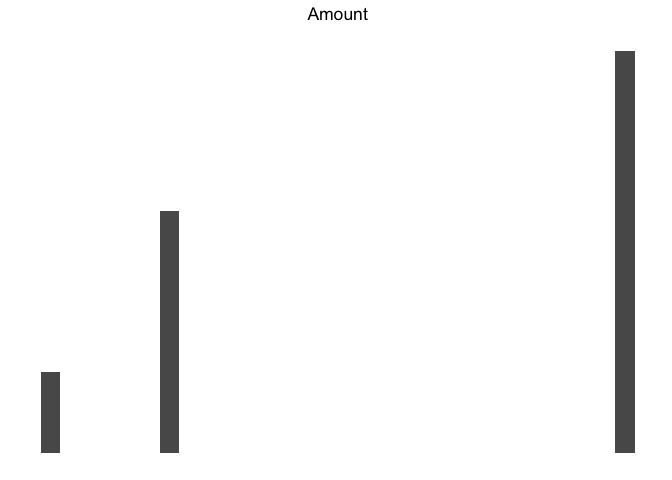
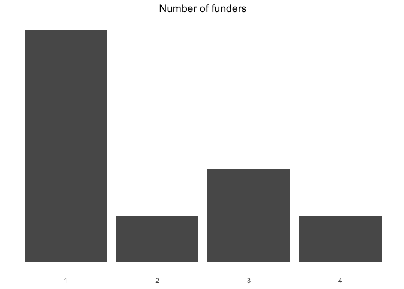
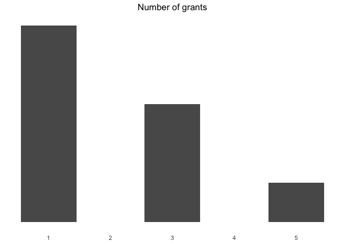

## Introduction
Follow The Leader is a research project by the Effective Philanthropy Learning Initiative of Stanford PACS. It is an inquiry into whether having access to better information about foundation grantmaking would change how individual donors make grants. 

The project's primary form is a webtool that summarizes top US foundation grantmaking activity, which allows the user to find nonprofits by subject area, geography, etc. and see grant-level information.

The hope is that this tool will help donors who want to "follow the leaders" in their giving, or at least better understand how their grants fit into a larger funding ecosystem.

## Overview
For a more detailed explanation of the dataset and project, contact Paul Gregg: <paul.n.gregg@gmail.com>

There are four primary indicators in this data:

* __Duration__. The average duration of grants awarded.
* __Grant amount__. The average dollar value of grants awarded.
* __Number of foundations supporting__. How many of the 50 foundations in the database chose to support these nonprofits.
* __Number of grants__. Over a 5-year period.

***

As an overview, here is how the entire dataset is distributed across these four indicators. 

 <!-- -->

This is dummy data. The actual project data is more interesting, hence these text explanations of the "fun facts" associated with the distributions of these indicators. 

 <!-- -->

Grant amount fun facts.

 <!-- -->

Number of funders fun facts.

 <!-- -->

Num grants fun facts go here.

